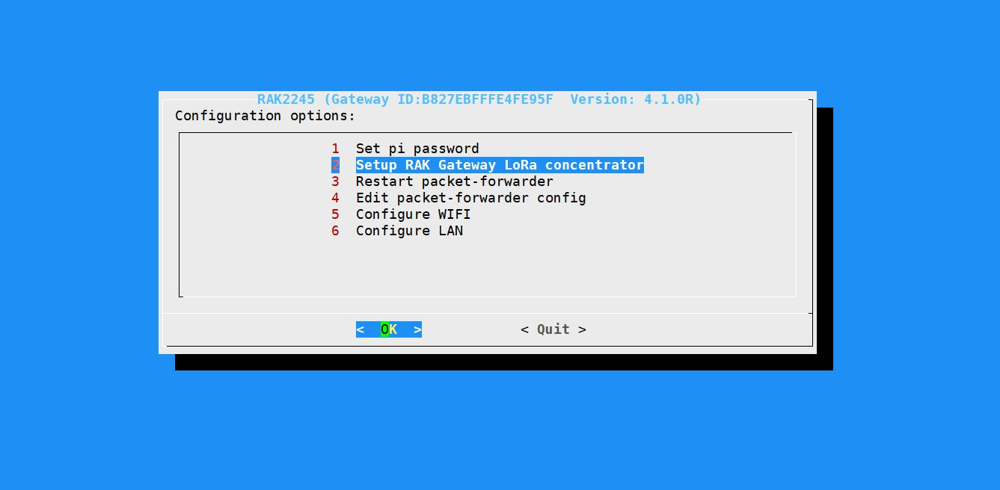
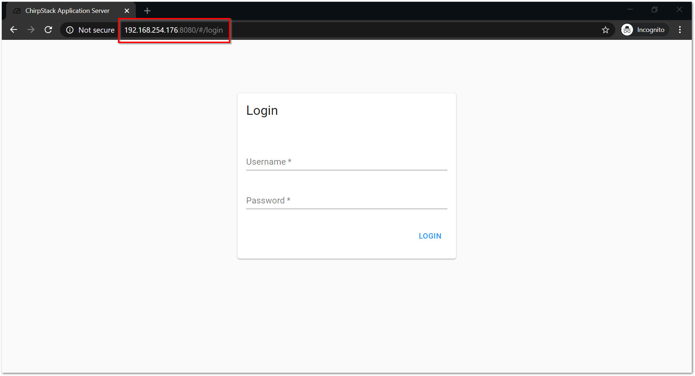

# 网关配置

## 准备条件

- [RAK2245 Pi HAT WisLink LPWAN Concentrator](https://docs.rakwireless.com/Product-Categories/WisLink/RAK2245-Pi-HAT/Overview/#product-description)
- [Raspberry Pi](https://www.raspberrypi.com/products/raspberry-pi-4-model-b/) 4B or 3B; maybe Raspberry Pi Zero W is also compatible.
- 16 GB 或以上 SD Card + 读卡器
- Windows/Linux/MacOS 兼容的 PC 机

## 刷入树莓派固件

下载 [balenaEtcher](https://www.balena.io/etcher/), 或者其他可以刷入树莓派固件至SD卡的工具.

从[此处](https://downloads.rakwireless.com/LoRa/RAK2245-Pi-HAT/Firmware/RAK2245_Latest_Firmware.zip)下载所需固件/系统. 请勿刷写树莓派官方的固件/系统,
虽然这是可行的, 但是不建议.

亦可以从 [downloads.rakwireless.com](https://downloads.rakwireless.com/LoRa/RAK2245-Pi-HAT/Firmware/) 此处获取所需的固件和详细资料.

如果你不喜欢预先安装的系统, 也可以从
[RAKWireless/rak_common_for_gateway](https://github.com/RAKWireless/rak_common_for_gateway)获取 RAK 网关的辅助工具, 将其安装至任意已经安装系统的树莓派,
安装过程参照其文档, 在此不再赘述.

刷入过程不赘述, 参考 [balenaEtcher](https://www.balena.io/etcher/).

## 配置 RAK 网关

参照
[RAK2245 Pi HAT Quick Start Guide](https://docs.rakwireless.com/Product-Categories/WisLink/RAK2245-Pi-HAT/Quickstart/#configuring-the-gateway),
这里只做简单说明.

**Before powering the Raspberry Pi 3B+ or 4, you should connect the LoRa and GPS antennas. Not doing so might damage the boards.**

**在给树莓派上电之前, 你应该连接LoRa和GPS天线. 如果不连接, 可能会损坏树莓派.**

### 连接到树莓派

通常有以下几种方式连接树莓派

- [Secure Shell](https://en.wikipedia.org/wiki/Secure_Shell) (SSH) 处于同一网络环境时
- 显示输出 -- [DisplayPort](https://en.wikipedia.org/wiki/DisplayPort)/[HDMI](https://en.wikipedia.org/wiki/HDMI)
- [RPi Serial Connection](https://elinux.org/RPi_Serial_Connection) 串口控制台

当然, 也可以通过 [USB On-The-Go](https://en.wikipedia.org/wiki/USB_On-The-Go) 加上 [Android Debug Bridge](https://developer.android.com/studio/command-line/adb) 连接树莓派, 但需要额外配置, 在此不赘述.

#### 查找树莓派 IP

在连入同一网络环境 (以太网/Wi-Fi) 下时, 可以使用 [mDNS](https://datatracker.ietf.org/doc/html/rfc6762) 直接访问树莓派, 使用 `主机名.local` 连接即可 (树莓派默认的主机名是`raspberrypi`, 但 RAK 的定制固件的主机名似乎是 `rak-gateway`).

更加直接/暴力的方式是使用 [Nmap](https://nmap.org/) 扫描开放的 22 端口, 当然前提是你的树莓派已经开放了`ssh`端口.

### 初始配置

假设你已经进入了 [Shell 环境](https://en.wikipedia.org/wiki/Unix_shell), 并且配置了网络环境. (如何连接 Wi-Fi 在此不再赘述)

```bash
sudo gateway-config
```

你会进入一个 TUI 环境, 在此可以设置网关的各种参数.



选择 `Setup RAK Gateway LoRa Concentrator` => `Server is Chirpstack` => `ChirpStack Channel-plan configuration` => `Server IP` 为默认的 `127.0.0.1`.

如果需要启用 [Adaptive Data Rate (自适应数据传输速率)](https://www.thethingsnetwork.org/docs/lorawan/adaptive-data-rate/) 功能, 可以选择 `Chirpstack ADR Configure` => `Enable ADR`.

此时使用外部浏览器访问 `http://[树莓派IP]:8080/` 即可访问 [ChirpStack](https://www.chirpstack.io/) 的网关配置界面.



网关界面的介绍在此不再赘述, 参照 [ChirpStack Application Server](https://www.chirpstack.io/application-server/) 的文档.

## 安装 Java 后端服务器

假设你已经配置好了 [Raspbian 源镜像](https://mirrors.ustc.edu.cn/help/raspbian.html)

项目源码位于 [HQU-gxy/vue-laser-backend](https://github.com/HQU-gxy/vue-laser-backend)

安装 JDK 和 MariaDB/MySQL 数据库.

```bash
sudo apt update
sudo apt install default-jdk mariadb-server
```

切换至 `~` 目录 (`$HOME`)

```bash
cd ~
```

### 数据库配置

用 `wget` 亦可下载, 下面使用`curl`演示

```bash
curl https://raw.githubusercontent.com/HQU-gxy/vue-laser-backend/master/sql/jiguang.sql -O
```

若出现 `curl: (35) OpenSSL SSL_connect: Connection reset by peer in connection to raw.githubusercontent.com:443` 检查你的代理配置, 或者从源码仓库中的 [sql/jiguang.sql](https://github.com/HQU-gxy/vue-laser-backend/blob/master/sql/jiguang.sql) 下载, 然后使用 SFTP 或者其他方法的上传到树莓派.

安装完成后, 运行 `mysql_secure_installation` 进行数据库安全设置, 并设置`root`密码. 参见 [mysql_secure_installation - MariaDB Knowledge Base](https://mariadb.com/kb/en/mysql_secure_installation/)

使用 `mysql` 命令连接数据库 (可能会需要 `-u`和`-p`参数), 并执行 `SOURCE jiguang.sql;` 命令, 完成数据库的初始化.

**权限问题请参照:** [mysql - Access denied for user 'root'@'localhost' (using password: YES) after new installation on Ubuntu - Stack Overflow](https://stackoverflow.com/questions/28068155/access-denied-for-user-rootlocalhost-using-password-yes-after-new-instal)

### 启动服务器

```bash
mkdir laser-java
cd laser-java
curl https://github.com/HQU-gxy/vue-laser-backend/releases/download/v0.0.1/target.zip -LO
unzip target.zip
rm target.zip
```

若下载失败, 检查你的代理配置, 中国大陆网络环境问题不再赘述.

此时文件目录结构如下:

```text
laser-java
├── config
│   └── application.yml
└── demo-maven-assembly.jar
```

运行 `java -jar demo-maven-assembly.jar` 即可启动服务器, 如有任何错误, 试着更改 `config/application.yml` 配置文件, 很有可能是数据库配置错误.

## 前端网页展示配置

有很多种方式可以完成前端网页展示配置, 下面使用 [`Node.js`](https://nodejs.org/) 配置开发服务器. 还有一种方式是在本地编译静态文件后, 将静态文件上传到树莓派, 在树莓派部署 [Nginx](https://www.nginx.com/) 或者 [Apache](https://httpd.apache.org/) 服务器, 在生产环境中更偏向与后者, 鉴于本项目仍在开发阶段, 暂时使用前者.

### 安装 Node.js

树莓派镜像源中的 Node.js 版本过于古老, 不推荐直接使用 `apt` 安装

参见 [How to install Node JS and NPM on the Raspberry Pi – MakerSupplies Singapore](https://www.makersupplies.sg/blogs/tutorials/how-to-install-node-js-and-npm-on-the-raspberry-pi) 和 [audstanley/NodeJs-Raspberry-Pi: Install NodeJs on your Raspberry Pi 1, 2, 3, 4, zero, and zero w](https://github.com/audstanley/NodeJs-Raspberry-Pi)

```bash
curl https://nodejs.org/dist/v16.13.1/node-v16.13.1-linux-armv7l.tar.xz -LO
tar -xzf node-v16.13.1-linux-armv7l.tar.xz
cd node-v16.13.1-linux-armv7l
sudo cp -R * /usr/local/ # copy all the file into /usr/local (which is in your PATH)
```

测试一下是否成功安装

```bash
node -v
npm -v
```

### 部署开发服务器

需要安装 [`git`](https://git-scm.com/)

```bash
sudo apt install git
```

clone [项目 repo](https://github.com/HQU-gxy/vue-laser) 到本地

```bash
git clone --recurse-submodules https://github.com/HQU-gxy/vue-laser
```

如果卡住不动, 或者出错, 多试几次, 或者配置代理

```bash
cd vue-laser
npm install
mv src/global.default.ts src/global.ts
npm serve
```

若 npm 速度慢可以考虑[配置中国 NPM 镜像](https://npmmirror.com/)

- [华为开源镜像站新手指导（NPM篇）_开源镜像站_DevCloud_华为云论坛](https://bbs.huaweicloud.com/forum/forum.php?mod=viewthread&tid=1803)

```bash
npm config set registry https://repo.huaweicloud.com/repository/npm/
npm cache clean -f
```

访问 `http://[树莓派IP]:8081` 应该就能看到它了

### 部署生产服务器

**Optional Step**
安装 Nginx, `npm build`, 写 `nginx.conf`, 静态文件丢到 `/var/www/html/` (某个随意的目录) 下, 并启动服务器.

## 开机自启

参照 [systemd - 编写单元文件 - ArchWiki](https://wiki.archlinux.org/title/Systemd_%28%E7%AE%80%E4%BD%93%E4%B8%AD%E6%96%87%29#%E7%BC%96%E5%86%99%E5%8D%95%E5%85%83%E6%96%87%E4%BB%B6)

把创建好的 Unit files 丢到 `/usr/lib/systemd/system` 然后 `sudo systemctl enable [你的 Unit file 名称]` 即可

### 前端 Unit 配置文件

```ini
[Unit]
# Human readable name of the unit
Description=Frontend server

[Service]
# Command to execute when the service is started
ExecStart=/usr/local/npm --prefix /home/pi/vue-laser/ serve
# set User variable as current user (pi in raspberry pi OS)
Type=idle
User=pi

[Install]
WantedBy=default.target
```

### 后端 Unit 配置文件

```ini
[Unit]
# Human readable name of the unit
Description=Java backend server

[Service]
# Command to execute when the service is started
ExecStart=java -jar /home/pi/laser-java/demo-maven-assembly.jar
# set User variable as current user (pi in raspberry pi OS)
Type=idle
User=pi

[Install]
WantedBy=default.target
```

## 网关添加新设备

见 [HQU-gxy/vue-laser-utils](https://github.com/HQU-gxy/vue-laser-utils)

由于 Node.js 跨平台性能不佳, 预计使用 Go 或者 Rust 重写, 目前先手动配置罢.
