# 准备事项
打开终端浏览器，地址输入'127.0.0.1:8083'进入登陆界面

点击登录即可登录到管理页面. 

# 地图
## 添加地图
### 新建地图
若是首次使用该系统, 需要新建一张地图方便之后的演习调用，以高德地图为例

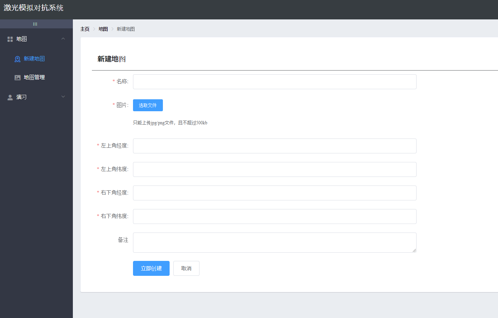

新建地图需要以下信息

- **名称** 地图的名称
- **图片** 需要作为地图背景的图片; 只能上传 `jpg` 或者 `png` 格式的图片
- **左上角的纬度** 一个长方形的地图通过左上角的经纬度和右下角的经纬度便可以确定地图的位置
- **左上角的经度** 
- **右下角的纬度** 
- **右下角的经度** 
- **备注** 备注信息

### 添加经纬度
下面以高德经纬度坐标为例，演示如何添加拾取经纬度
进入高德坐标拾取器：https://lbs.amap.com/tools/picker  搜索所需要进行演习的地点，确定演习地点。
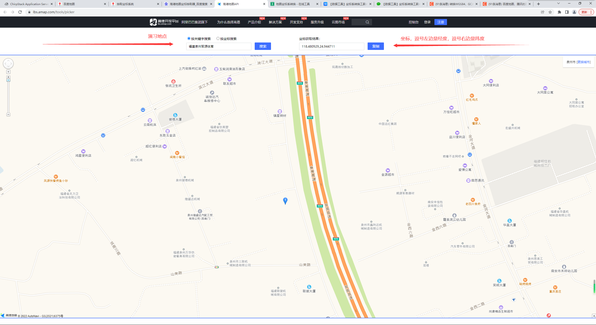

框出所需要演习地点的范围，并得到左上角，右下角经纬度坐标。
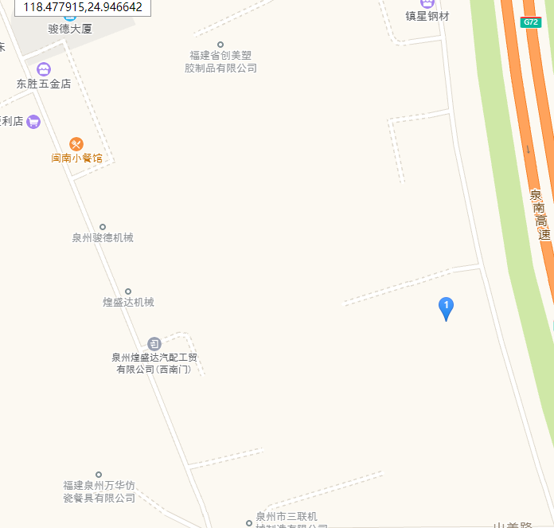

将鼠标移至对应点，即可得到对应坐标
#### 左上角
- **左上角纬度** 24.946647
- **左上角经度** 118.477937
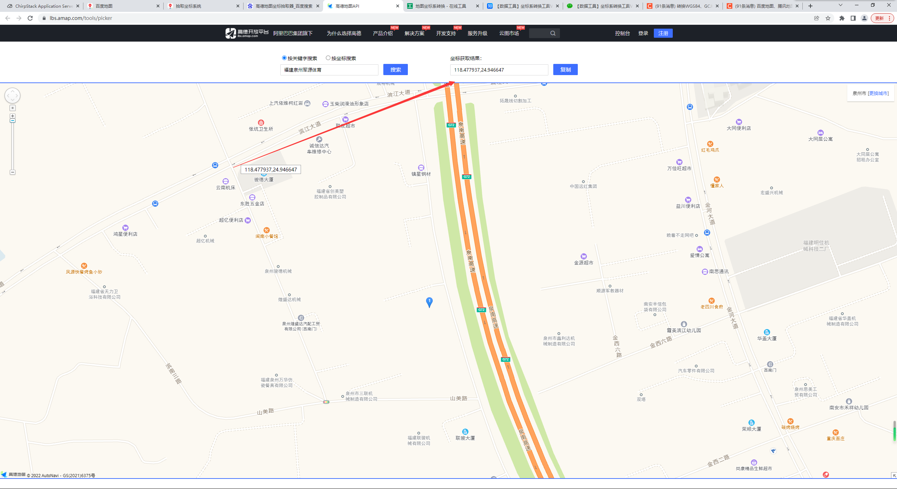

#### 右下角
- **右下角纬度** 24.943427
- **右下角经度** 118.481681
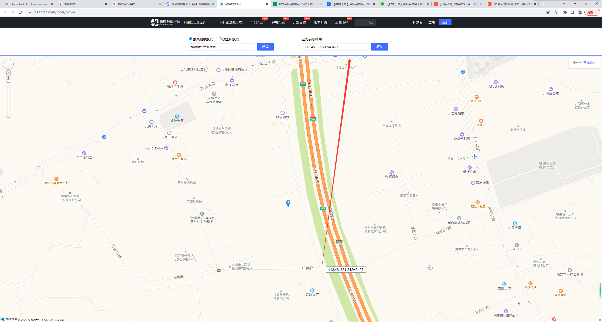

#### 百度地图转换坐标系
若使用百度地图，需要对坐标进行转化，将坐标系转化为GCJ02。 转化工具地址：https://tool.lu/coordinate/
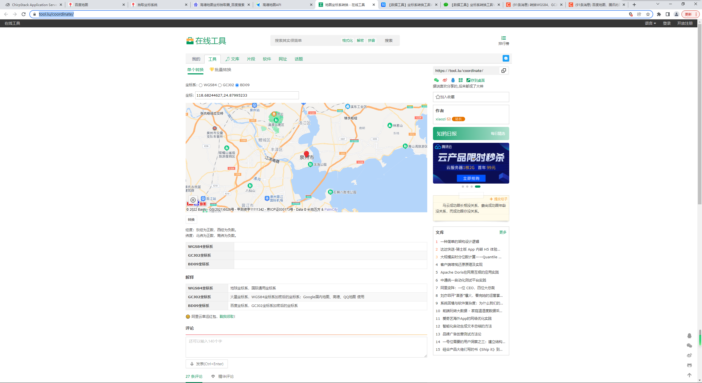

### 信息载入
- **名称** 军源
- **图片** 军源体育范围
- **左上角的纬度** 24.946647
- **左上角的经度** 118.477937
- **右下角的纬度** 24.943427
- **右下角的经度** 118.481681
- **备注** 军源体育地图1

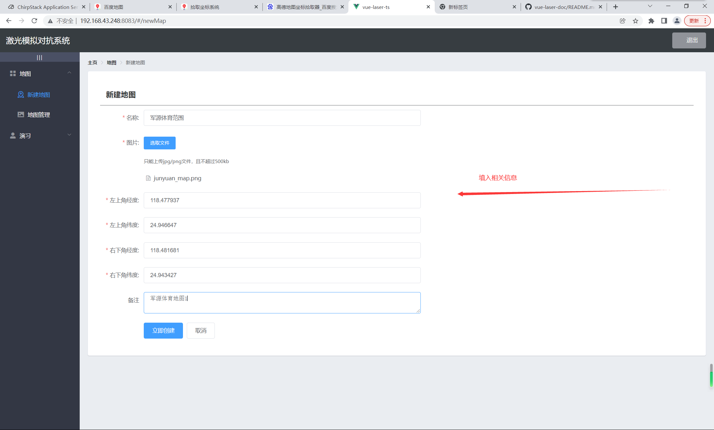

## 管理地图
在此页面可以查看和删除已经设置好的地图

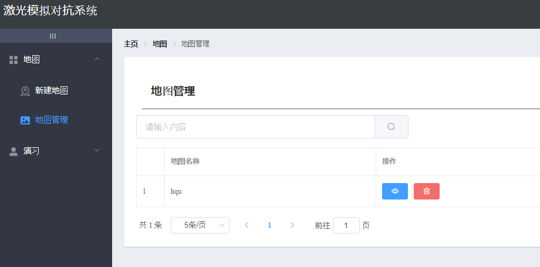

# 演习
## 添加方案
### 新建方案
新建演习需要以下信息

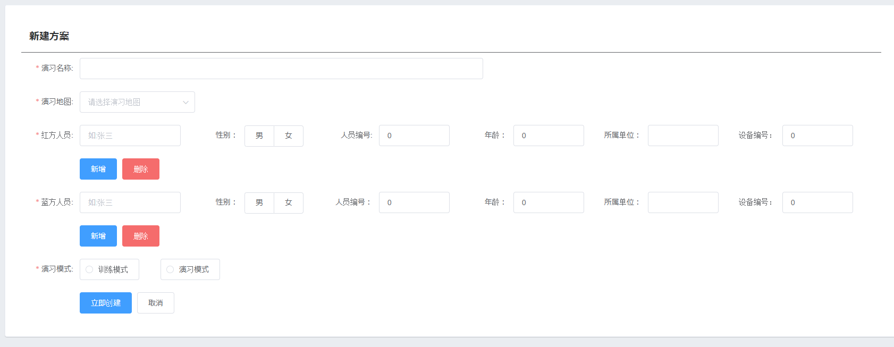

- **演习名称** 该演习方案的名称
- **演习地图** 该演习方案所使用的地图
- **红方人员** 该演习中红方人员的详细信息
  - **姓名** 该人员在演习系统中显示的姓名
  - **性别** 该人员在演习系统中显示的性别
  - **年龄** 该人员在演习系统中显示的年龄
  - **所属单位** 该人员在演习系统中显所属单位
  - **人员编号** 该人员在演习系统的人员编号, 范围为 0 到 65535, 必须与**设备固件中记录的人员编号**一致
  - **设备编号** 该人员在演习系统的设备编号, 格式为 64 bit EUI (Extended Unique Identifier), 必须与**设备固件中记录的设备编号**一致
- **蓝方人员** 该演习中蓝方人员的详细信息, 具体参照上方*红方人员*的说明
- **演习模式** 保留位, 目前无实际作用

设备编号可在下拉菜单中进行选择，添加设备可在设备管理界面进行管理
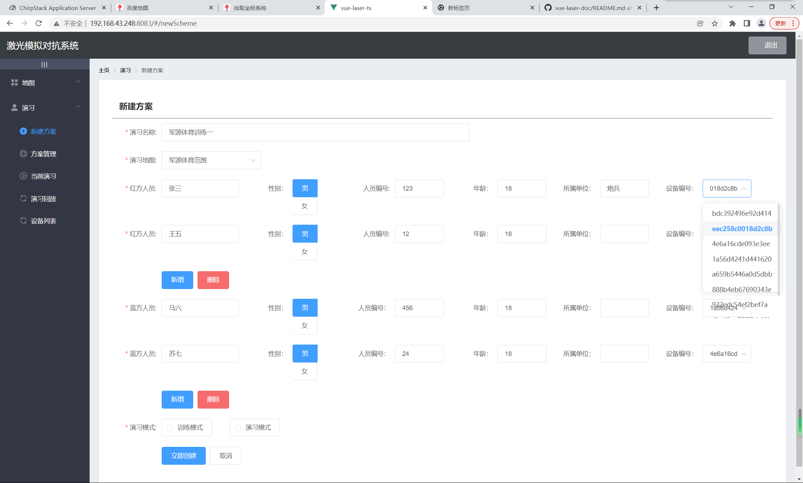

### 新建方案示例
首先查看设备列表，确定人员编号与设备编号
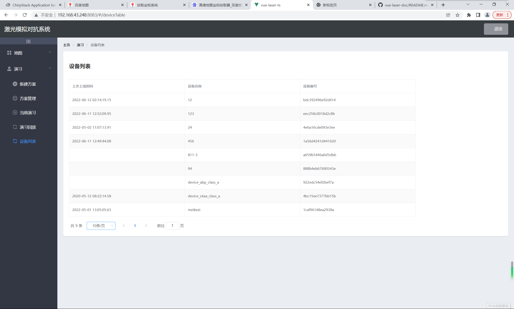

添加人员示例

- **演习名称** 军源体育训练一
- **演习地图** 军源体育范围
- **红方人员** 
  - **姓名** 张三
  - **性别** 男
  - **年龄** 18
  - **所属单位** 炮兵
  - **人员编号** 123
  - **设备编号** 1a56d4241d441620
- **蓝方人员** 该演习中蓝方人员的详细信息, 具体参照上方*红方人员*的说明
- **演习模式** 保留位, 目前无实际作用

## 方案管理
可以查看已经创建好的方案, 并且执行

- **开始演习** 开始一个未开始的演习, 将给所有终端节点发送演习开始信号, 并且跳转至*当前演习*页面
- **加载正在进行的演习** 若要在一个新的设备观看已经进行的演习, 或者在不小心关闭浏览器之后恢复对演习情况的观看, 则需要点击该按钮. 否则*当前演习*页面中的地图将不会加载
- **删除** 删除该演习方案

## 当前演习
在该页面中可以观察已经开始的演习

刚才创建的演习示例
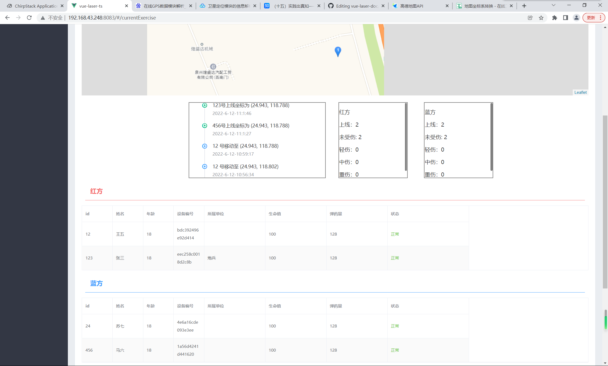
> 若地图加载不出来, 见[常见错误](#常见错误)

若出现「是否开始录屏」的提示, 根据自身需求选择即可

> 若没有出现「是否开始录屏」的提示, 而是出现了「错误，请检查浏览器是否设置正确。录屏功能将被禁用」, 见[常见错误](#常见错误). 若不需要录屏则可以忽视该提示. 

若要截取整个屏幕, 请选择整个屏幕

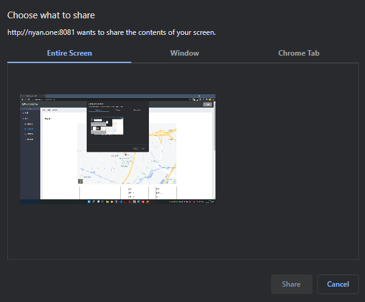

若仅仅要求截取标签页内内容, 请选择 Chrome 标签页

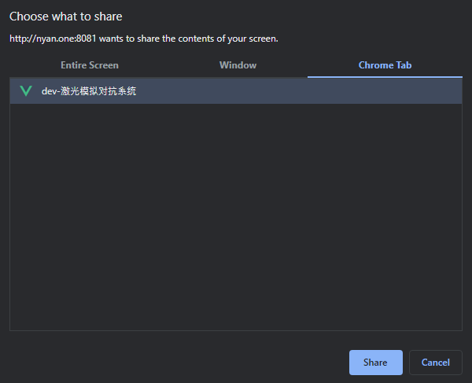

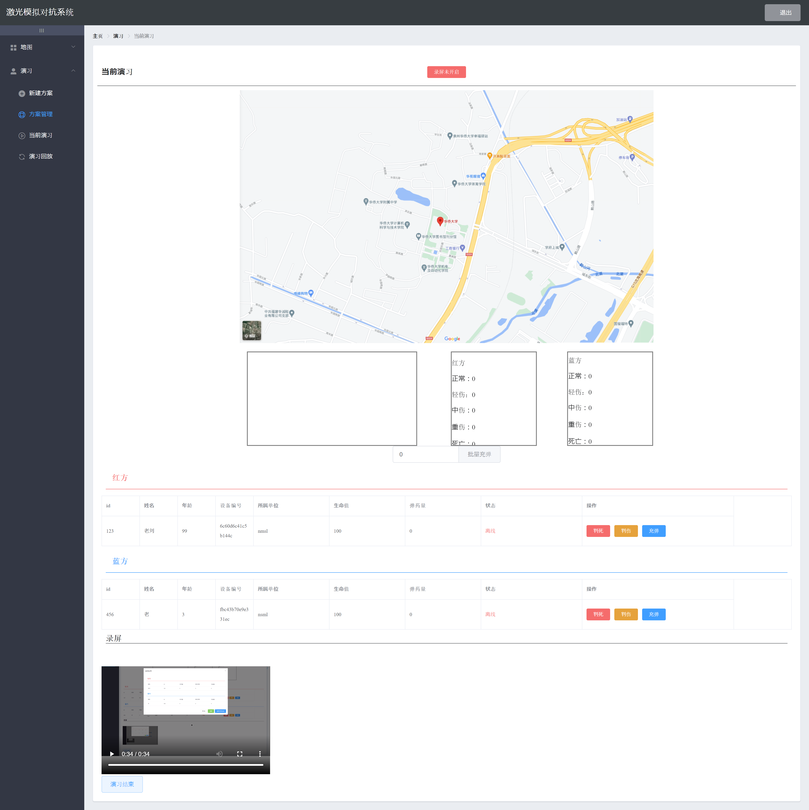

点击**演习结束**可以查看战局的统计信息并且结束整个演习. 如果演习时间较长，上传视频需要一定时间，需要耐心等待. 

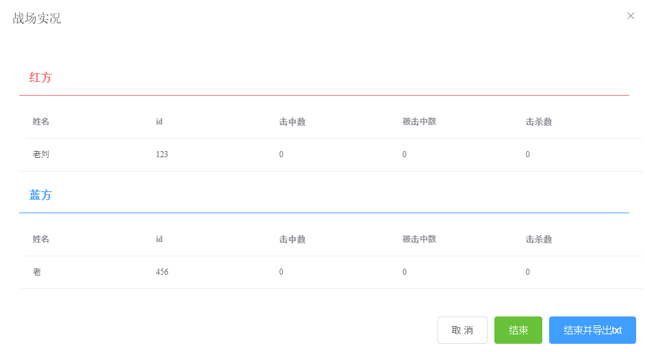

## 演习回放
若开启了录屏功能, 则可以在此处看到演习的录屏回放和战局的统计信息. 

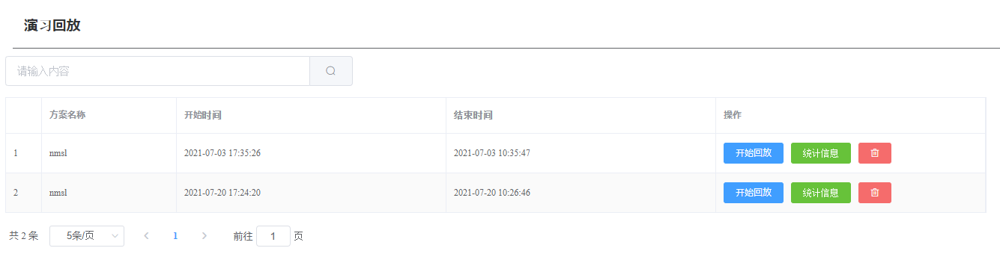

## 设备管理

# 常见错误

## 「当前演习」界面地图加载不出来
到*方案管理*页面点击**加载正在进行的演习**按钮重新加载即可

## 录屏功能将被禁用
若使用 Chrome 浏览器, 可以在地址栏输入`chrome://flags/#unsafely-treat-insecure-origin-as-secure`

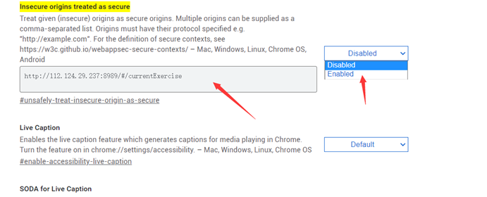

在其中输入[准备事项](#准备事项)中的地址, 允许 http 调用录屏 API. 

或者也可以换用其他浏览器如 Firefox. 
